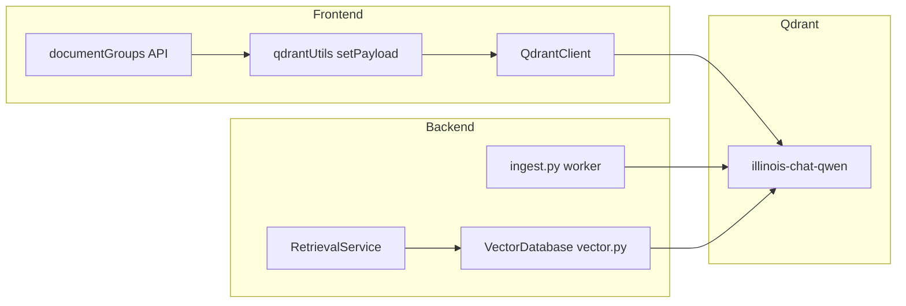

# Qdrant to pgvector migration plan

## Current architecture (summary)

- **Frontend:** [uiuc-chat-frontend/src/utils/qdrantUtils.ts](self-hostable-uiuc-chat/uiuc-chat-frontend/src/utils/qdrantUtils.ts) calls `qdrant.setPayload(collection, { payload: { doc_groups }, filter })` where filter = `course_name` + optional `url` + `s3_path`. Used by [documentGroups.ts](self-hostable-uiuc-chat/uiuc-chat-frontend/src/pages/api/documentGroups.ts) after SQL doc-group updates.
- **Backend ingest:** [ai_ta_backend/rabbitmq/ingest.py](self-hostable-uiuc-chat/uiuc-chat-backend/ai_ta_backend/rabbitmq/ingest.py) creates collection (4096, Cosine) if missing; batches `PointStruct(id=uuid, vector=embedding, payload=metadata|page_content)` and calls `qdrant_client.upsert`. Payload includes: `course_name`, `s3_path`, `readable_filename`, `url`, `base_url`, `doc_groups`, `pagenumber`, `chunk_index`, `timestamp`, `page_content`, and optionally `conversation_id`.
- **Backend retrieval:** [ai_ta_backend/database/vector.py](self-hostable-uiuc-chat/uiuc-chat-backend/ai_ta_backend/database/vector.py) implements `vector_search`, `vector_search_with_filter`, `delete_data` via `qdrant_client.search` / `delete` with filters. [retrieval_service.py](self-hostable-uiuc-chat/uiuc-chat-backend/ai_ta_backend/service/retrieval_service.py) uses these and expects results with `.payload` (dict) and `.score`; it also calls `vdb.qdrant_client.upsert` for conversation-scoped chunks (line ~1110).

---

## 1. pgvector schema (same semantics as Qdrant)

- **Table:** One table (e.g. `embeddings`) in the existing Postgres used by the app (same DB as [init-scripts/init-vector.sql](self-hostable-uiuc-chat/init-scripts/init-vector.sql)).
- **Columns:** Match Qdrant “schema” and filter/search usage:
  - `id` (BIGSERIAL or UUID PRIMARY KEY). For migration, storing Qdrant point id in a `qdrant_id` (UUID) column allows idempotency; new ingest can use UUID as primary key or a separate id.
  - `embedding` VECTOR(4096) NOT NULL.
  - Payload as columns (recommended for same behavior and indexing): `page_content TEXT`, `course_name TEXT`, `s3_path TEXT`, `readable_filename TEXT`, `url TEXT`, `base_url TEXT`, `doc_groups TEXT` (or JSONB array), `chunk_index INT`, `pagenumber INT` (or TEXT), `timestamp TEXT`, `conversation_id TEXT` (nullable).
  - Optional: `metadata JSONB` for any extra fields and backward compatibility.
  - `created_at` / `updated_at` if desired.
- **Indexes:** GIN on `metadata` if used; B-tree (or GIN) on `course_name`, `s3_path`, `conversation_id` for filter translation. No HNSW (pgvector limit 2000 dimensions); cosine search via `<=>` and sequential scan.
- **Init:** Extend [init-vector.sql](self-hostable-uiuc-chat/init-scripts/init-vector.sql) with the above (or a new migration script if table already exists). Ensure init runs on fresh DB or apply manually.

---

## 2. Backend: Vector store abstraction and pgvector implementation

- **Abstraction:** Introduce a small interface (e.g. `VectorStoreProtocol`) used by ingest and by [VectorDatabase](self-hostable-uiuc-chat/uiuc-chat-backend/ai_ta_backend/database/vector.py): methods such as `upsert_batch(ids, vectors, payloads)`, `search(embedding, filter, limit)`, `search_with_filter(embedding, filter, limit)`, `update_payload(filter, payload_update)`, `delete_by_filter(key, value)`. Keep the same method names/signatures where possible so retrieval and ingest call the same interface.
- **Filter translation:** Implement a helper that converts the current Qdrant `models.Filter` (from `_create_search_filter` / `_create_conversation_search_filter`) into a SQL WHERE clause and params. Map:
  - `course_name` MatchValue → `course_name = $1`
  - `doc_groups` MatchAny → `doc_groups ?| $2` (if JSONB array) or equivalent
  - `is_empty conversation_id` → `(conversation_id IS NULL OR conversation_id = '')`
  - `conversation_id` MatchValue → `conversation_id = $3`
  - must_not doc_groups → `NOT (doc_groups ?| $4)`
  - Combine with AND/OR to mirror Qdrant must/should/must_not.
- **pgvector implementation:**
  - **Search:** `SELECT id, embedding, page_content, course_name, ... , (1 - (embedding <=> $query_embedding)) AS score FROM embeddings WHERE <translated_filter> ORDER BY embedding <=> $query_embedding LIMIT $top_n`. Return a list of objects with `.payload` (dict built from columns) and `.score` so [retrieval_service.py](self-hostable-uiuc-chat/uiuc-chat-backend/ai_ta_backend/service/retrieval_service.py) `_process_search_results` works unchanged.
  - **Upsert (ingest):** INSERT into `embeddings` (id/qdrant_id, embedding, page_content, course_name, s3_path, ...) with ON CONFLICT (id) DO UPDATE to match Qdrant upsert semantics, in batches (reuse current batch size from env).
  - **Upsert (conversation chunks):** Same INSERT/ON CONFLICT from [retrieval_service.py](self-hostable-uiuc-chat/uiuc-chat-backend/ai_ta_backend/service/retrieval_service.py) via the new interface instead of calling `vdb.qdrant_client.upsert` directly.
  - **Update payload (setPayload equivalent):** `UPDATE embeddings SET doc_groups = $1 WHERE course_name = $2 AND s3_path = $3 AND (url = $4 OR ($4 IS NULL AND url IS NULL))` (and similar for frontend filter). Return a result that can be interpreted as “completed” for the frontend (e.g. row count or success flag).
  - **Delete:** `DELETE FROM embeddings WHERE <key> = $value` (e.g. `s3_path = $1`).
- **Configuration:** Use an env var (e.g. `VECTOR_STORE=qdrant|pgvector`). When `pgvector`, wire `VectorDatabase` and ingest to the pgvector implementation (Postgres connection from existing config: `POSTGRES_*` or Supabase). When `qdrant`, keep current Qdrant client and behavior.

---

## 3. Ingest worker (ingest.py)

- Replace direct `qdrant_client.create_collection` / `qdrant_client.upsert` and indexing-threshold logic with the new vector-store interface.
  - If using pgvector: ensure table exists (run init/migration once); then call `upsert_batch(ids, vectors, payloads)` with payloads expanded to columns. No “collection create” or indexing threshold; batch INSERT/ON CONFLICT only.
- Keep the rest of the flow (embedding API, chunking, SQL insert, doc groups) unchanged. Same env for batch size; optional env for vector store type.

---

## 4. Frontend: doc_groups update (setPayload equivalent)

- **Option A (recommended):** Backend exposes a small API (e.g. `POST /api/update-doc-groups` or existing documentGroups action) that accepts `courseName`, `doc` (with `s3_path`, `url`, `doc_groups`) and performs the UPDATE on `embeddings` (pgvector) when vector store is pgvector. Frontend [documentGroups.ts](self-hostable-uiuc-chat/uiuc-chat-frontend/src/pages/api/documentGroups.ts) stops calling Qdrant; instead it calls this backend endpoint (or the same Next.js API handler calls the backend service that runs the UPDATE). No Qdrant client in the frontend for this flow.
- **Option B:** Frontend gets a Postgres connection (or serverless driver) and runs the same UPDATE in [qdrantUtils.ts](self-hostable-uiuc-chat/uiuc-chat-frontend/src/utils/qdrantUtils.ts) when `VECTOR_STORE=pgvector`. Less ideal (credentials and DB in frontend).
- **Compatibility:** Keep the same contract: after SQL addDocumentsToDocGroup, “vector store update” must succeed or the API rolls back the SQL change. So the new path (backend UPDATE or frontend UPDATE) must return a success/failure that documentGroups.ts can interpret like the current `qdrantResponse.status === 'completed'`.

---

## 5. One-time data migration (existing Qdrant → pgvector)

- Export from Qdrant: scroll through `QDRANT_COLLECTION_NAME` (e.g. illinois-chat-qwen), page by page, collecting point id, vector, payload.
- Transform: map payload to pgvector columns (page_content, course_name, s3_path, doc_groups, etc.); handle `doc_groups` as string or array depending on schema choice.
- Load: batch INSERT into `embeddings` (with ON CONFLICT if using qdrant id). Run after table is created and before switching traffic to pgvector.
- Optional: script in backend (e.g. `scripts/migrate_qdrant_to_pgvector.py`) that uses existing Qdrant client and Postgres connection to do the above.

---

## 6. Configuration and rollout

- **Env:** Add `VECTOR_STORE=pgvector` (or `qdrant`). Backend and (if used) frontend read it. Add `POSTGRES_*` (or reuse existing Supabase/Postgres) for pgvector connection when applicable.
- **Docker/compose:** Already have [postgres-illinois-chat](self-hostable-uiuc-chat/docker-compose.dev.yaml) with pgvector and [init-vector.sql](self-hostable-uiuc-chat/init-scripts/init-vector.sql) mounted. Ensure init script includes the full schema (payload columns). No need to run Qdrant service when using pgvector only for Illinois Chat.
- **Rollout:** Run migration script; set `VECTOR_STORE=pgvector`; restart backend and (if changed) frontend; smoke-test ingest, search, doc_groups update, and delete. Keep Qdrant in compose and code path until fully validated; then remove or leave as fallback.

---

## 7. Files to touch (concise)

| Area                | Files                                                                                                                                                                                                                                                                                                                                                                  |
| ------------------- | ---------------------------------------------------------------------------------------------------------------------------------------------------------------------------------------------------------------------------------------------------------------------------------------------------------------------------------------------------------------------- |
| Schema              | [init-scripts/init-vector.sql](self-hostable-uiuc-chat/init-scripts/init-vector.sql) (or new migration) – add payload columns, indexes.                                                                                                                                                                                                                                |
| Backend abstraction | New module (e.g. `ai_ta_backend/database/vector_store.py`) – protocol + pgvector implementation + filter-to-SQL.                                                                                                                                                                                                                                                       |
| Backend vector DB   | [ai_ta_backend/database/vector.py](self-hostable-uiuc-chat/uiuc-chat-backend/ai_ta_backend/database/vector.py) – use abstraction when `VECTOR_STORE=pgvector`; keep Qdrant for `qdrant` and for Vyriad/cropwizard.                                                                                                                                                     |
| Backend ingest      | [ai_ta_backend/rabbitmq/ingest.py](self-hostable-uiuc-chat/uiuc-chat-backend/ai_ta_backend/rabbitmq/ingest.py) – use vector store interface for create/upsert; remove direct Qdrant collection/upsert for main collection.                                                                                                                                             |
| Backend retrieval   | [ai_ta_backend/service/retrieval_service.py](self-hostable-uiuc-chat/uiuc-chat-backend/ai_ta_backend/service/retrieval_service.py) – use vdb for conversation upsert (no direct `vdb.qdrant_client.upsert` for main collection).                                                                                                                                       |
| Frontend doc groups | [uiuc-chat-frontend/src/pages/api/documentGroups.ts](self-hostable-uiuc-chat/uiuc-chat-frontend/src/pages/api/documentGroups.ts), [uiuc-chat-frontend/src/utils/qdrantUtils.ts](self-hostable-uiuc-chat/uiuc-chat-frontend/src/utils/qdrantUtils.ts) – call backend update-doc-groups (or pgvector UPDATE) when pgvector; keep or remove Qdrant client for doc_groups. |
| Migration script    | New script (e.g. `scripts/migrate_qdrant_to_pgvector.py`) – scroll Qdrant, INSERT into pgvector.                                                                                                                                                                                                                                                                       |
| Config              | [.env](self-hostable-uiuc-chat/.env) (or env example) – `VECTOR_STORE`, Postgres URL if not already present.                                                                                                                                                                                                                                                           |

---

## 8. Out of scope (unchanged)

- Vyriad / cropwizard / patents / pubmed Qdrant instances and their collections stay on Qdrant; only the main Illinois Chat collection (QDRANT_COLLECTION_NAME) moves to pgvector.
- [misc/upload_embeddings.py](self-hostable-uiuc-chat/uiuc-chat-backend/misc/upload_embeddings.py), [pubmed_vectorize.py](self-hostable-uiuc-chat/uiuc-chat-backend/ai_ta_backend/utils/pubmed_vectorize.py), [migrate_qdrant_hosting.py](self-hostable-uiuc-chat/uiuc-chat-backend/ai_ta_backend/utils/migrate_qdrant_hosting.py) are separate flows; they can remain Qdrant-specific unless you want to migrate those too later.

This keeps schema and behavior the same (same payload fields, same filters, same API contract for doc_groups and search) while moving the main vector store to pgvector.
