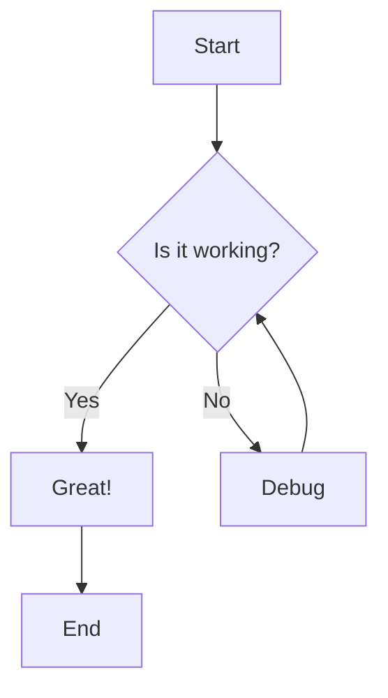
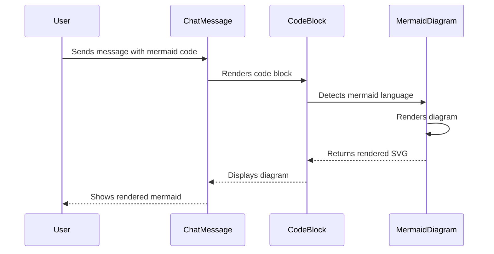
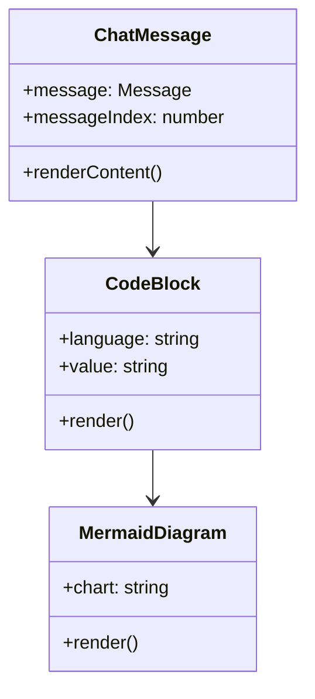

# Mermaid.js Integration for ChatMessage

This document explains how Mermaid.js diagrams are now supported in the ChatMessage component.

## Overview

The ChatMessage component now supports rendering Mermaid diagrams when code blocks are marked with the `mermaid` language. Instead of showing syntax-highlighted code, these blocks will render as interactive diagrams.

## How it Works

1. **Detection**: When a code block has `language="mermaid"`, the CodeBlock component detects this and renders it using the MermaidDiagram component instead of syntax highlighting.

2. **Rendering**: The MermaidDiagram component uses the Mermaid.js library to parse and render the diagram as SVG.

3. **Error Handling**: If there's an error in the Mermaid syntax, it displays an error message with the option to view the original code.

## Usage

In your chat messages, you can now include Mermaid diagrams like this:

### Flowchart Example
````markdown

````

### Sequence Diagram Example
````markdown

````

### Class Diagram Example
````markdown

````

## Components Added

### MermaidDiagram.tsx
- Renders Mermaid diagrams using the Mermaid.js library
- Handles errors gracefully with fallback display
- Supports loading states
- Responsive design with horizontal scrolling for wide diagrams

### Modified CodeBlock.tsx
- Detects when `language="mermaid"`
- Renders MermaidDiagram component instead of syntax highlighting
- Maintains the same header with copy/download buttons

## Styling

Added CSS styles in `globals.css`:
- `.mermaid-container`: Container for rendered diagrams
- `.mermaid-error`: Error state styling
- Dark mode support
- Responsive design with overflow handling

## Dependencies

- `mermaid`: The core Mermaid.js library
- `@types/mermaid`: TypeScript type definitions

## Testing

You can test the integration using the `MermaidTest.tsx` component which demonstrates various diagram types.

## Supported Diagram Types

Mermaid.js supports many diagram types including:
- Flowcharts
- Sequence diagrams
- Class diagrams
- State diagrams
- Entity Relationship diagrams
- User Journey diagrams
- Gantt charts
- Pie charts
- Git graphs
- And more...

For complete documentation on Mermaid syntax, visit: https://mermaid.js.org/intro/